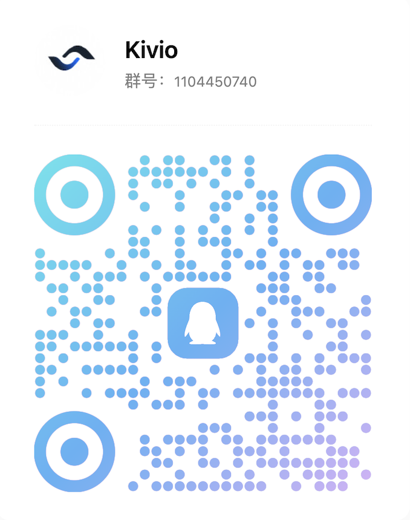
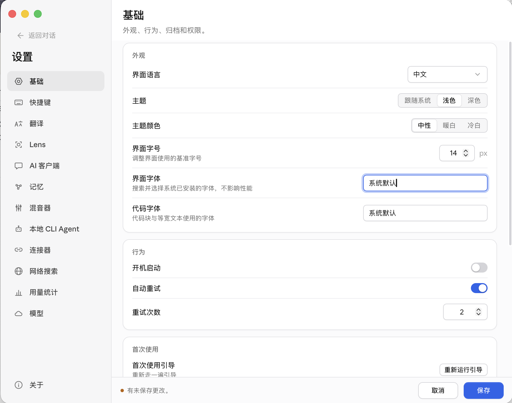

<p align="center">
  
</p>

<h1 align="center">Kivio Desktop</h1>

<p align="center">
  <strong>macOS / Windows 屏幕级 AI 助手：一个 Agentic AI 客户端，加上即时翻译、截图 OCR、视觉问答 —— 全部一键呼出，全部用你自己的 API Key。</strong>
</p>

<p align="center">
  <a href="https://github.com/ZMGID/kivio/releases/latest"></a>
  
  
  
  
</p>

<p align="center">
  <a href="https://github.com/ZMGID/kivio/releases/latest"><strong>下载</strong></a>
  &nbsp;·&nbsp;
  <a href="#功能">功能</a>
  &nbsp;·&nbsp;
  <a href="#热键">热键</a>
  &nbsp;·&nbsp;
  <a href="#快速开始">快速开始</a>
  &nbsp;·&nbsp;
  <a href="#english">English</a>
  &nbsp;·&nbsp;
  QQ 群：<strong>1104450740</strong>
</p>

<p align="center">
  
</p>

---

## Kivio Desktop 是什么？

Kivio Desktop 常驻托盘 / 菜单栏，工作在整个**屏幕**层面，而不只是自己的窗口里。在任何地方按下热键：翻译你输入的、翻译你选中的、翻译你看到的，或者框选屏幕任意区域直接向 AI 提问。从托盘打开 AI 客户端，则是一个完整的 Agent 聊天应用：工具调用、子代理、Skills、MCP、知识库、Python 沙箱、多模型并排回答。

代码里落实的三条设计原则：

- **自带 Key。** 所有 AI 调用都走你自己配置的服务商 —— 原生支持 OpenAI 兼容、Anthropic、Google Gemini 三类协议。没有账号系统，没有中转服务器。
- **本地、安静。** 全无遥测和统计上报；唯一的后台网络请求是 GitHub 版本检查。设置与对话数据只存在本机磁盘。
- **空闲时轻。** 窗口按需创建、关闭即销毁（不是隐藏），空闲进程保持很小的占用。

<a name="功能"></a>

## AI 客户端

<p align="center">
  
</p>

与服务商无关的 Agent 运行时，带真正的工具循环，不是聊天套壳。

**一次问多个模型。** 把一个问题同时发给多个模型，以标签页或并排分栏对比回答。每个回答独立流式生成，某个模型报错不影响其他列，最后由你点选哪个回答进入后续上下文。

**原生工具**（每个可单独开关，文件/终端类工具需按对话授权一次）：

| 分组 | 工具 |
|---|---|
| 网络 | `web_search`、`web_fetch` |
| 文件 | `read`（文件、目录、图片）、`grep`、`glob`、`write`、`edit` |
| 终端 | `bash`，支持可追踪的后台任务（`bash_output`、`kill_background`） |
| Python | `run_python` —— 离线 Pyodide 沙箱，随包内置 numpy、pandas、matplotlib、pillow、micropip |
| 知识库 | `knowledge_search`，回答带 `[n]` 引用 |
| 记忆 | `memory_read` / `memory_modify` / `memory_search` 长期记忆 |
| Agent | `agent`（子代理）、`todo_write`、`ask_user`、图片生成 |

**子代理。** 内置 `general-purpose`、`researcher`、`coder`、`reviewer` 四种人格，各有工具白名单；模型在一条消息里就能并行分派多个。也可以用 Markdown 文件添加自己的子代理。

**Skills。** Markdown 定义的技能，对话中即时激活。内置：`pdf`、`docx`、`xlsx`、`diagram`、`doc-coauthoring`、`frontend-design`、`mcp-builder`、`skill-creator`、`himalaya`（邮件）。支持从文件夹或 ZIP 导入自己的技能。

**MCP。** 接入外部 Model Context Protocol 服务器（stdio 或 streamable HTTP），持久会话、JSON 导入、实时连接状态。

**知识库（RAG）。** 多库文档检索：混合搜索（sqlite-vec 向量 + FTS5 BM25，RRF 融合）+ 可选重排。支持导入 txt / csv / markdown / html / docx / xlsx / pdf（文本层），图片走 OCR 入库，网页可按 URL 导入。回答中的 `[n]` 引用可点击跳转来源。

**连接器。** Obsidian（笔记库注入）、邮箱（Himalaya IMAP/SMTP）、Notion、GitHub、Linear、Sentry、Atlassian、Composio —— Token 或 OAuth 2.1 + PKCE。

**外部 CLI Agent。** 把对话交给已安装的终端 Agent 接管 —— Claude Code、codex、cursor、opencode、gemini、kimi、pi、hermes —— 自动检测、流式输出、会话管理都已内置。

**长对话不失忆。** 上下文压缩内建在循环里：先用轻量 "microcompact" 降解旧工具结果，预算不够时才动用 LLM 摘要，界面上有可视化的压缩时间线。

**还有：** 项目与集两种对话组织方式、对话全文搜索、文件/图片附件、助手搭建器、带审批策略的计划/编排模式、Agent 待办列表、生成文件卡片（`~/Kivio/outputs/`）、按调用的 Token 用量统计。

## 屏幕工具

### Lens —— 截什么，问什么

<p align="center">
  
</p>

一个热键冻结屏幕。拖拽框选区域（macOS 还可以直接点选窗口），可以画红色箭头指着要问的地方，然后提问。回答流式呈现：思考过程收在可折叠的推理块里，公式由 KaTeX 渲染，最多保留 20 条截图+问答历史。Lens 还会自己规划联网搜索（Tavily / Exa / Exa MCP / Ollama / Grok —— Exa MCP 无 Key 也有低额度可用）并展示来源。一键即可把截图 —— 或整段多轮对话 —— 交接到 AI 客户端继续。

<p align="center">
  
  <br>
  <sub>截取屏幕上的文字，原地继续处理。</sub>
</p>

### 翻译，四种姿势

<p align="center">
  
</p>

- **快速翻译** —— 鼠标旁弹出小输入框，边输边译（600 ms 防抖）；回车把译文写入剪贴板，并可自动粘贴回原来的应用。
- **选中翻译** —— 通过无障碍 API 抓取当前选中文本（失败时回退剪贴板方案），弹出可拖动的浮动译文卡；没选中任何内容则静默不弹。
- **截图翻译** —— 框选区域或窗口，译文流式出现在选区旁的卡片里，下方附识别出的原文。
- **替换翻译** —— 框选后，译文按行直接"画"在原文位置上，背景色取自截图采样，融入原画面。行定位固定使用 RapidOCR。

每种模式的提示词都可编辑（支持 `{lang}` / `{text}` 占位符），卡片宽度可调，流式输出可开关。

### OCR 引擎

截图翻译的文字识别三选一，在设置中切换：

- **云端视觉模型**（默认）—— 一次多模态调用同时完成 OCR + 翻译。
- **系统 OCR** —— macOS 走 Apple Vision（随包 Swift sidecar），Windows 走 Windows.Media.Ocr。
- **RapidOCR** —— 完全离线的 PaddleOCR（PP-OCRv6 medium，50 种语言）ONNX 管线；由用户主动一键下载（约 139 MB 模型 + ONNX Runtime）。替换翻译固定使用此引擎。

## 模型与服务商

- **四种原生协议：** OpenAI Chat Completions、OpenAI Responses、Anthropic Messages、Google Gemini `generateContent` —— 各是一等适配器，不经有损的兼容层。
- **预设** DeepSeek、OpenRouter、SiliconFlow、GLM、Ollama Cloud，各带"获取 API Key"直达链接；任何 OpenAI 兼容端点都可以自定义添加。
- **按功能路由：** 翻译、截图翻译、Lens、每个聊天对话都可以分别指定服务商和模型；视觉、标题摘要、压缩、图片生成还有各自独立的默认模型槽位。
- **多 Key 故障转移：** 每个服务商可配置一组 Key。鉴权错误（401/402/403）立即换 Key；限流（429）先退避重试、超过阈值才切换；失败的 Key 冷却 60 秒。服务器错误只退避、不消耗备用 Key。
- **按模型覆盖**（上下文窗口、最大输出、能力、价格），以及按服务商的 gzip 请求体压缩开关（应付挑剔的 WAF 网关）。

## 设置

<p align="center">
  
</p>

设置内嵌在 AI 客户端窗口里：通用、翻译、截图、Lens、聊天、记忆、默认模型、Kivio Code、外部 Agent、MCP、Skills、联网搜索、连接器、知识库、用量、服务商、关于。亮点：首次启动分步引导（服务商 → 联网搜索 → 快捷键）、设置导出/导入备份、主题色预设与深色模式、中英双语界面、开机自启，以及一个只存内存的请求调试面板 —— 密钥自动掩码、可复制为 cURL。

## Kivio Code

仓库还内置 `kivio-code`：基于同一套运行时的终端编码 Agent（Rust CLI/TUI），也可用主程序的 `kivio code` 子命令启动，自带会话、MCP 配置与技能装载。

<a name="热键"></a>

## 热键

| 功能 | macOS | Windows |
|---|---|---|
| 快速翻译 | `⌘⌥T` | `Ctrl+Alt+T` |
| 截图翻译 | `⌘⇧A` | `Ctrl+Shift+A` |
| 选中翻译 | `⌘⇧T` | `Ctrl+Shift+T` |
| 替换翻译 | `⌘⇧R` | `Ctrl+Shift+R` |
| Lens 截图问答 | `⌘⇧G` | `Ctrl+Shift+G` |

所有热键都是开关式（再按一次关闭），可在设置中重新绑定（带冲突检测）。托盘菜单：打开 AI 客户端 · 显示翻译器 · 设置 · 退出。

<a name="快速开始"></a>

## 快速开始

1. **[下载最新版](https://github.com/ZMGID/kivio/releases/latest)** —— macOS：Apple Silicon `.dmg` · Windows：NSIS `-setup.exe`。
2. **安装并启动。** DMG 未签名，首次打开请右键 → 打开，或执行：
   ```bash
   xattr -cr "/Applications/Kivio Desktop.app"
   ```
   macOS 会请求**辅助功能**（热键、选中取词、粘回）与**屏幕录制**（截图）权限；屏幕捕获基于 ScreenCaptureKit。Windows 手动启动时默认打开 AI 客户端。
3. **跟随首次引导** —— 添加服务商，可选配置联网搜索，确认快捷键。
4. **开始用。** 托盘 → 打开 AI 客户端做聊天、工具与文档；或在任意界面按热键使用翻译和 Lens。

Kivio Desktop 启动后会检查 GitHub Releases 的新版本（可关闭），并支持应用内直接下载安装更新。

## 新版本 —— v2.8.4

- **右侧 Dock：文件树、Git 审查、真实终端** —— 聊天窗右侧新增按工作目录绑定的 IDE 侧栏。文件树支持框选多选、拖拽移动、批量删除、内联新建/重命名与就地查看编辑；Git 面板看改动与 diff；终端是真正的 PTY（forkpty / ConPTY）。工具卡片的 Write/Edit 显示 `+N -N`，展开是带行号列与词级高亮的 diff，点文件名即在右侧预览。
- **claude CLI 改为一会话一常驻进程** —— 不再每轮重开子进程：首轮约 3.2 秒，之后每轮约 0.1 秒。换模型不再丢上下文；子会话（Task）不再把自述印进主回答、不再污染用量与压缩分母；停止改用 `interrupt` 控制请求而非杀进程。
- **上下文用量终于是准的** —— 所有外部 CLI 都漏算了 cache token（实测 kimi 97.6%、pi 62%、opencode 13%），且各家 cache 包含关系不同（codex 已含在 input 内，claude/pi/ACP 须相加）。分母也修了：claude 裸别名实测都是 100 万上下文，旧表一律按 20 万算，压缩在真实占用 20% 就触发。用量现在实时更新。
- **MCP 改用官方 rmcp SDK** —— 两套手写 JSON-RPC 合成一条通路，净删约 2270 行，「设置页测试连接」与「聊天里调用」不再表现不一致。顺带修好：远程 HTTP MCP 加了工具无需重启即可见；Windows 上 `npx.cmd` 这类 shim 不再找不到；装了企业 TLS 中间证书的用户从「连不上」变「能连」。
- **工具审批改为内联卡片，claude CLI 也会来问** —— 输入框上方的内联卡片：自然语言标题、只放路径或命令的代码块、带数字快捷键的三个动作，新增本对话「总是允许」。外部 claude CLI 接进同一条审批链路。并发审批不再只留最后一张卡（此前另外两张会静默超时被拒）。
- **对话生命周期 Hooks** —— 内置 agent 的 8 个生命周期事件可挂 Shell 脚本或 HTTP Hook，载荷走 stdin JSON + `KIVIO_*` 环境变量。fire-and-forget，不阻断工具调用；没配 Hook 时零开销。设置新增 Hooks 页。
- **子代理角色通用化** —— 角色列表在运行时生成进 `agent` 工具描述（内置/用户/项目三层），不必再猜名字；字段照 Claude Code / Cursor 的 `.md` + frontmatter 事实标准，拷来的角色文件直接可用。支持工具通配、`disallowedTools` 继承减法与调用内临时角色。
- **界面：悬浮卡片式侧栏与 Windows 全宽标题栏** —— 侧栏/主区/Dock 改为三张浮起的卡片，侧栏支持系统级模糊材质（Windows Mica 跟应用主题）。Windows 三键改为贯穿全宽的 44px 标题栏带，内容不再留 132px 躲它。全站下拉栏统一规格、输入区拆三层、表格与代码块重做、等宽字体补 CJK 回退、macOS 顶栏那条线统一到同一基线。
- **图片右键菜单** —— 新增复制图片 / 图片另存为… / 查看大图（内嵌图与生成图两条路径都挂上）；大图查看器的复制与另存取原图而非缩略图。
- **claude 模型清单剔掉 6 个退役 / 会被静默换掉的模型** —— 目录不等于可用：4 个已退役（选了只回退役警告），`opus-4-1` / `opus-4-0` 更糟——不报错，直接给你 Opus 4.8。
- **稳定性与正确性修复** —— 退出不再留孤儿 claude 进程及其 MCP 子孙；外部 CLI 调过工具的回答不再渲染两遍；grok 的 token 用量在 `_meta` 里，此前一路读空；系统提示改走 `--append-system-prompt-file`，长会话压缩后不再静默失效；`/cost` 等客户端斜杠命令输出不再被吞；被截断的回答不再标成「完成」；探测不再堆空壳会话；流式思考不再逐帧抖动。

完整历史:[GitHub Releases](https://github.com/ZMGID/kivio/releases)。

## 开发

| 层 | 技术栈 |
|---|---|
| 后端 | Rust · Tauri v2 |
| 前端 | React 18 · TypeScript · Vite · TailwindCSS v4 |
| OCR | Apple Vision（Swift sidecar）· Windows.Media.Ocr · RapidOCR（ONNX） |
| Python 沙箱 | Pyodide，随包离线 |

```bash
npm install
npm run dev          # 完整应用：Rust 后端 + Vite UI（macOS 上自动构建 Swift sidecar）
npm run dev:ui       # 仅 Vite UI，不编译 Rust

npm run lint         # ESLint，零警告
npm run typecheck    # tsc --noEmit
npm test             # Vitest 前端测试
cargo test --manifest-path src-tauri/Cargo.toml   # Rust 测试
```

架构说明：[CLAUDE.md](CLAUDE.md) 与 `docs/`。

## 许可证

GPL-3.0-or-later © ZM。见 [LICENSE](LICENSE)。

## 社区

- [LINUX DO](https://linux.do)
- QQ 群：**1104450740**

---

<a name="english"></a>

<h1 align="center">Kivio Desktop · English</h1>

<p align="center">
  <strong>A screen-level AI assistant for macOS and Windows: an agentic AI client, plus instant translation, screenshot OCR, and visual Q&A — all one hotkey away, all on your own API keys.</strong>
</p>

<p align="center">
  <a href="https://github.com/ZMGID/kivio/releases/latest"><strong>Download</strong></a>
  &nbsp;·&nbsp;
  <a href="#features">Features</a>
  &nbsp;·&nbsp;
  <a href="#hotkeys">Hotkeys</a>
  &nbsp;·&nbsp;
  <a href="#quick-start">Quick Start</a>
  &nbsp;·&nbsp;
  <a href="#kivio-desktop">中文</a>
  &nbsp;·&nbsp;
  QQ Group: <strong>1104450740</strong>
</p>

---

## What is Kivio Desktop?

Kivio Desktop lives in your tray / menu bar and works at the level of your *screen*, not just inside its own window. Press a hotkey anywhere to translate what you typed, translate what you selected, translate what you see, or capture any region and ask AI about it. Open the AI client from the tray and you get a full agentic chat app: tool calls, sub-agents, Skills, MCP servers, a knowledge base, a Python sandbox, and side-by-side multi-model answers.

Design principles, as implemented in code:

- **Bring your own keys.** Every AI call goes to providers *you* configure — OpenAI-compatible, Anthropic, and Google Gemini native protocols. No account, no middleman server.
- **Local and quiet.** No telemetry or analytics of any kind; the only background network call is the GitHub release check for updates. Settings and conversations stay on disk on your machine.
- **Light when idle.** Windows are created on demand and *destroyed* on close (not hidden), so the idle process keeps a small footprint.

<a name="features"></a>

## The AI Client

<p align="center">
  
</p>

A provider-agnostic agent runtime with a real tool loop, not a thin chat wrapper.

**Ask many models at once.** Fan one question out to multiple models and compare the answers in tabs or side-by-side columns. Each answer streams independently; one model failing never blocks the rest, and you choose which answer the conversation continues from.

**Native tools** (each individually toggleable, file/shell tools ask for per-conversation consent):

| Group | Tools |
|---|---|
| Web | `web_search`, `web_fetch` |
| Files | `read` (files, directories, images), `grep`, `glob`, `write`, `edit` |
| Shell | `bash` with tracked background jobs (`bash_output`, `kill_background`) |
| Python | `run_python` — offline Pyodide sandbox, bundled with numpy, pandas, matplotlib, pillow, micropip |
| Knowledge | `knowledge_search` with `[n]` citations |
| Memory | `memory_read` / `memory_modify` / `memory_search` long-term memory |
| Agent | `agent` (sub-agents), `todo_write`, `ask_user`, image generation |

**Sub-agents.** Built-in personas — `general-purpose`, `researcher`, `coder`, `reviewer` — each with its own tool allow-list; the model can dispatch several in parallel from a single message. You can add your own as markdown files.

**Skills.** Markdown-defined skills, activated mid-conversation. Bundled: `pdf`, `docx`, `xlsx`, `diagram`, `doc-coauthoring`, `frontend-design`, `mcp-builder`, `skill-creator`, `himalaya` (email). Import your own from folders or ZIPs.

**MCP.** Connect external Model Context Protocol servers over stdio or streamable HTTP, with persistent sessions, JSON import, and live connection status.

**Knowledge base (RAG).** Multi-library document retrieval: hybrid search (sqlite-vec vectors + FTS5 BM25, fused by Reciprocal Rank Fusion) with an optional reranker. Ingests txt / csv / markdown / html / docx / xlsx / pdf (text layer), plus images via OCR and web pages via URL import. Answers cite sources as clickable `[n]` markers.

**Connectors.** Obsidian (vault injection), Email (IMAP/SMTP via Himalaya), Notion, GitHub, Linear, Sentry, Atlassian, Composio — token or OAuth 2.1 + PKCE.

**External CLI agents.** Hand a conversation over to an installed terminal agent — Claude Code, codex, cursor, opencode, gemini, kimi, pi, or hermes — with detection, streaming, and session management built in.

**Long conversations that keep working.** Context compaction runs inside the loop: a cheap "microcompact" pass degrades old tool results first, and an LLM summary kicks in only when needed, with a visible compaction timeline in the UI.

**And the rest:** projects and sets for organizing conversations, full-text conversation search, file/image attachments, an assistant builder, plan/orchestrate mode with approval policies, agent todo lists, generated-file cards (`~/Kivio/outputs/`), and per-call token usage statistics.

## Screen Tools

### Lens — capture and ask

<p align="center">
  
</p>

One hotkey freezes the screen. Drag a region (or, on macOS, click a window), optionally draw red arrows to point at things, then ask. Answers stream in with reasoning shown in a collapsible thinking block, LaTeX rendered by KaTeX, and up to 20 capture+Q&A entries kept in history. Lens can also plan its own web searches (Tavily / Exa / Exa MCP / Ollama / Grok — Exa MCP works keyless at low quota) and show the sources it used. One click sends the screenshot — or the entire multi-turn exchange — into the AI client to continue.

<p align="center">
  
  <br>
  <sub>Capture text on screen and work with it in place.</sub>
</p>

### Translation, four ways

<p align="center">
  
</p>

- **Quick translator** — a small input popup at your cursor; results appear as you type (600 ms debounce), Enter copies the translation and can auto-paste it back into the app you came from.
- **Selected-text translation** — grabs the current selection via Accessibility APIs (with a clipboard fallback) and shows a floating, draggable translation card. Nothing pops up if nothing is selected.
- **Screenshot translation** — capture a region or window; the translation streams into a card next to the selection, with the recognized original underneath.
- **Replace translation** — capture a region and the translation is painted *over* the original text on a canvas, line by line, with background color sampled from the screenshot so it blends in. Uses RapidOCR for line positions.

Prompts for each mode are editable (`{lang}` / `{text}` placeholders), card width is adjustable, and streaming can be toggled.

### OCR engines

Screenshot translation can recognize text three ways, selectable in Settings:

- **Cloud vision model** (default) — one multimodal call does OCR + translation together.
- **System OCR** — Apple Vision on macOS (via a bundled Swift sidecar) or Windows.Media.Ocr on Windows.
- **RapidOCR** — fully offline PaddleOCR (PP-OCRv6 medium, 50 languages) ONNX pipeline; a one-click, user-initiated download (~139 MB models + ONNX Runtime). Replace translation always uses this engine.

## Models & Providers

- **Four native wire protocols:** OpenAI Chat Completions, OpenAI Responses, Anthropic Messages, and Google Gemini `generateContent` — each a first-class adapter, so no feature is lost to a compatibility layer.
- **Presets** for DeepSeek, OpenRouter, SiliconFlow, GLM, and Ollama Cloud, each with a "get API key" link; any OpenAI-compatible endpoint works via custom provider.
- **Per-feature routing:** the translator, screenshot translation, Lens, and each chat conversation can each use a different provider and model; separate default slots exist for vision, title summarization, compaction, and image generation.
- **Multi-key failover:** each provider holds a pool of API keys. Auth errors (401/402/403) switch keys immediately; rate limits (429) retry with backoff and only switch after a threshold; failed keys cool down for 60 s. Server errors back off without burning backup keys.
- **Per-model overrides** (context window, max output, capabilities, pricing) and a per-provider gzip request-body toggle for WAF-fussy gateways.

## Settings

<p align="center">
  
</p>

Settings live inside the AI client window: General, Translate, Screenshot, Lens, Chat, Memory, default-model routing, Kivio Code, external agents, MCP, Skills, Web Search, Connectors, Knowledge Base, Usage, Providers, and About. Highlights: a first-run wizard (provider → web search → hotkeys), settings export/import backup, theme color presets with dark mode, bilingual UI (中文/English), autostart, and a request debug panel that records recent provider calls in memory only — keys masked, copy-as-cURL.

## Kivio Code

The repo also ships `kivio-code`, a terminal coding agent (Rust CLI/TUI) built on the same runtime — also reachable as `kivio code` from the main binary, with its own sessions, MCP setup, and skill staging.

<a name="hotkeys"></a>

## Hotkeys

| Action | macOS | Windows |
|---|---|---|
| Quick translator | `⌘⌥T` | `Ctrl+Alt+T` |
| Screenshot translation | `⌘⇧A` | `Ctrl+Shift+A` |
| Selected-text translation | `⌘⇧T` | `Ctrl+Shift+T` |
| Replace translation | `⌘⇧R` | `Ctrl+Shift+R` |
| Lens capture & ask | `⌘⇧G` | `Ctrl+Shift+G` |

All hotkeys act as toggles and are remappable in Settings (with conflict detection). The tray menu has: Open AI Client · Show Translator · Settings · Quit.

<a name="quick-start"></a>

## Quick Start

1. **[Download the latest release](https://github.com/ZMGID/kivio/releases/latest)** — macOS: Apple Silicon `.dmg` · Windows: NSIS `-setup.exe`.
2. **Install and launch.** The DMG is unsigned; on first launch right-click → Open, or run:
   ```bash
   xattr -cr "/Applications/Kivio Desktop.app"
   ```
   macOS will ask for **Accessibility** (hotkeys, selected-text capture, paste-back) and **Screen Recording** (capture) permissions. Screen capture uses ScreenCaptureKit. On Windows, launching manually opens the AI client.
3. **Follow the first-run wizard** — add a provider, optionally set up web search, confirm hotkeys.
4. **Go.** Tray → Open AI Client for chat, tools, and documents; or press a hotkey anywhere for translation and Lens.

Kivio Desktop checks GitHub Releases for updates shortly after launch (can be disabled) and can download and install the update in-app.

## What's New — v2.8.4

- **Right dock: file tree, Git review, real terminal** — an IDE-style dock bound to the conversation's working directory. The file tree has marquee/Ctrl/Shift multi-select, drag-to-move, batch delete, inline create/rename, and an in-place viewer/editor; the Git panel shows changes and diffs; the terminal is a real PTY (forkpty / ConPTY). Write/Edit tool cards show `+N -N` and expand into a diff with line-number gutters and word-level highlighting — click a filename to preview it in the dock.
- **The claude CLI now keeps one process per conversation** — no more respawning every turn: ~3.2s for the first turn, ~0.1s after. Switching models no longer drops context; sub-agent (Task) sidechains no longer leak their narration into the main answer or pollute usage and the compaction denominator; stopping sends an `interrupt` control request instead of killing the process.
- **Context usage numbers are finally correct** — every external CLI was dropping cache tokens (measured at 97.6% of the total for kimi, 62% for pi, 13% for opencode), and each CLI nests cache differently (codex has it inside input; claude/pi/ACP must add it). The denominator is fixed too: claude's bare aliases all resolve to 1M-context models, but the old table assumed 200K, so compaction fired at 20% of real usage. Usage now updates live.
- **MCP now runs on the official rmcp SDK** — two hand-written JSON-RPC implementations collapsed into one path, ~2270 lines deleted, and "test connection" in settings no longer behaves differently from an actual tool call in chat. Side effects: remote HTTP MCP servers surface newly added tools without a restart; Windows shims like `npx.cmd` resolve correctly; users behind a corporate TLS middlebox go from "cannot connect" to "connects".
- **Inline tool approval, and the claude CLI now asks too** — an inline card above the composer: plain-language title, a code block holding only the path or command, three number-keyed actions, plus a new per-conversation "always allow". The external claude CLI feeds the same approval chain. Concurrent approvals no longer collapse to just the last card (the others used to silently time out as denied).
- **Conversation lifecycle hooks** — eight lifecycle events of the built-in agent can trigger shell scripts or HTTP hooks, with the payload delivered as stdin JSON plus `KIVIO_*` env vars. Fire-and-forget, never blocking a tool call, and zero cost with no hooks configured. Settings gains a Hooks page.
- **Sub-agent roles are now user-definable** — the role list is generated into the `agent` tool's description at runtime across all three layers (built-in / user / project), so the model no longer has to guess names; fields follow the Claude Code / Cursor `.md`-plus-frontmatter standard, so copied role files work as-is. Adds tool wildcards, subtractive `disallowedTools`, and one-off roles defined inline at the call site.
- **UI: floating-card sidebar and a full-width Windows titlebar** — sidebar, main area, and dock became three floating cards, with system blur materials on the sidebar (Windows Mica follows the app theme). On Windows the three window buttons moved to a full-width 44px titlebar, so views no longer reserve 132px to dodge them. Also: one dropdown spec across the app, a three-tier composer, reworked tables and code blocks, a CJK fallback in the monospace stack, and macOS titlebar items sharing one baseline.
- **Image context menu** — Copy image / Save image as… / View full size on both rendering paths (markdown-embedded and generated-image gallery); the full-size viewer's copy and save operate on the original, not the thumbnail.
- **Six retired or silently-remapped models removed from the claude picker** — catalog ≠ available: four are retired (picking one returns only a retirement warning), and `opus-4-1` / `opus-4-0` are worse — no error, you silently get Opus 4.8.
- **Stability and correctness fixes** — quitting no longer leaves orphaned claude processes and their MCP grandchildren behind; external-CLI answers that used tools no longer render twice; grok's token usage lives under `_meta` and was read as empty all along; the system prompt moved to `--append-system-prompt-file` so it survives compaction; output from client-side slash commands like `/cost` is no longer swallowed; answers truncated at the output limit are no longer marked complete; probing no longer piles up empty shell sessions; streaming reasoning no longer janks frame by frame.

Full history: [GitHub Releases](https://github.com/ZMGID/kivio/releases).

## Development

| Layer | Stack |
|---|---|
| Backend | Rust · Tauri v2 |
| Frontend | React 18 · TypeScript · Vite · TailwindCSS v4 |
| OCR | Apple Vision (Swift sidecar) · Windows.Media.Ocr · RapidOCR (ONNX) |
| Python sandbox | Pyodide, bundled offline |

```bash
npm install
npm run dev          # full app: Rust backend + Vite UI (builds Swift sidecar on macOS)
npm run dev:ui       # Vite UI only, no Rust compile

npm run lint         # ESLint, zero warnings allowed
npm run typecheck    # tsc --noEmit
npm test             # Vitest frontend suite
cargo test --manifest-path src-tauri/Cargo.toml   # Rust tests
```

Architecture notes: [CLAUDE.md](CLAUDE.md) and `docs/`.

## License

GPL-3.0-or-later © ZM. See [LICENSE](LICENSE).

## Community

- [LINUX DO](https://linux.do)
- QQ Group: **1104450740**
