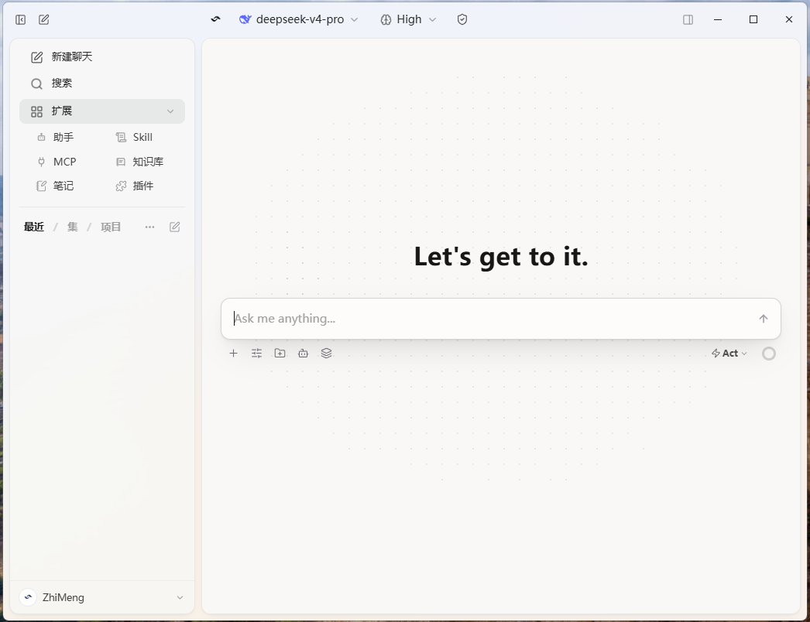

<p align="center">
  <a href="README.md">English</a>
  &nbsp;·&nbsp;
  <a href="README.zh-CN.md">中文</a>
</p>

<p align="center">
  
</p>

<h1 align="center">Kivio Desktop</h1>

<p align="center">
  <strong>A screen-level AI assistant for macOS and Windows: an agentic client, plus translation, screenshot OCR, and visual Q&amp;A. Hotkey anywhere, your own API keys.</strong>
</p>

<p align="center">
  <a href="https://github.com/ZMGID/kivio/releases/latest"></a>
  
  
  
  
</p>

<p align="center">
  <a href="https://github.com/ZMGID/kivio/releases/latest"><strong>Download</strong></a>
  &nbsp;·&nbsp;
  <a href="#features">Features</a>
  &nbsp;·&nbsp;
  <a href="#hotkeys">Hotkeys</a>
  &nbsp;·&nbsp;
  QQ: <strong>1104450740</strong>
</p>

<p align="center">
  
</p>

---

Lives in the tray. Hotkeys translate typing, selection, or what's on screen; capture a region and ask. The client is a full agent: tools, sub-agents, Skills, MCP, knowledge base, multi-model replies.

Bring your own keys. No account, no proxy, no telemetry. Data stays on disk.

## Features

<p align="center">
  
</p>

- **Chat** — tool loop, sub-agents, Skills, MCP, knowledge base, attachments; one question, many models.
- **External CLIs** — hand a conversation to Claude Code, Codex, Cursor, OpenCode, Gemini, Kimi, Pi, Hermes, Grok, or DeepSeek Harness if they're installed.
- **Lens** — freeze the screen, select a region (or a window on macOS), ask, optionally annotate, send the thread back to chat.
- **Translate** — quick, selection, screenshot, and in-place replace.

<p align="center">
  
</p>

<p align="center">
  
</p>

Protocols: OpenAI Chat Completions / Responses, Anthropic, Gemini. Translator, screenshot, Lens, and each chat can use a different model.

## Hotkeys

| Action | macOS | Windows |
|---|---|---|
| Open chat | `⌘⇧K` | `Ctrl+Shift+K` |
| Quick translate | `⌘⌥T` | `Ctrl+Alt+T` |
| Screenshot translate | `⌘⇧A` | `Ctrl+Shift+A` |
| Selection translate | `⌘⇧T` | `Ctrl+Shift+T` |
| Replace translate | `⌘⇧R` | `Ctrl+Shift+R` |
| Lens | `⌘⇧G` | `Ctrl+Shift+G` |

Toggles, remappable in Settings.

## Install

[Latest release](https://github.com/ZMGID/kivio/releases/latest) — macOS `.dmg` (Apple Silicon) · Windows `-setup.exe` or unzip-and-run `-portable.zip`.

The DMG is unsigned. First launch: right-click → Open, or:

```bash
xattr -cr "/Applications/Kivio Desktop.app"
```

macOS needs Accessibility and Screen Recording. Then follow the onboarding wizard.

## What's New — v2.9.3

- Windows portable zip
- Official / hosted DeepSeek search
- Compact attachment cards; reply to the last turn with another model
- External CLI catch-up: Claude Code 2.1.238, Codex 0.148, dsh rc.8

[Releases](https://github.com/ZMGID/kivio/releases)

## Development

```bash
npm install
npm run dev          # Rust + UI (builds Swift sidecar on macOS)
npm run dev:ui       # Vite only
npm run lint && npm run typecheck && npm test
cargo test --manifest-path src-tauri/Cargo.toml
```

GPL-3.0-or-later © ZM · [LINUX DO](https://linux.do) · QQ **1104450740**
